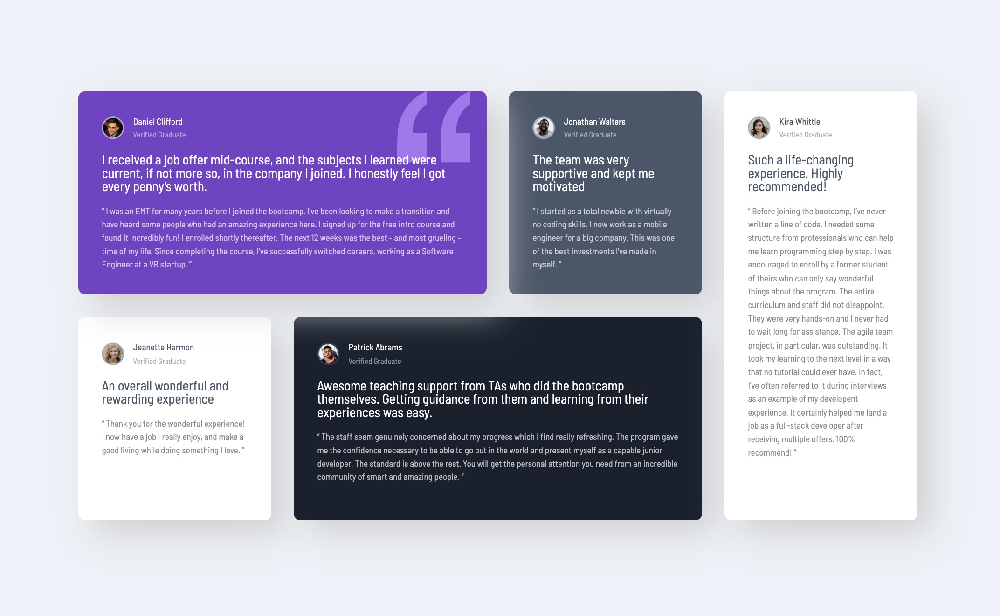

# Frontend Mentor - Testimonials grid section solution

This is a solution to the [Testimonials grid section challenge on Frontend Mentor](https://www.frontendmentor.io/challenges/testimonials-grid-section-Nnw6J7Un7). Frontend Mentor challenges help you improve your coding skills by building realistic projects.

## Table of contents

- [Overview](#overview)
  - [The challenge](#the-challenge)
  - [Screenshot](#screenshot)
  - [Links](#links)
- [My process](#my-process)
  - [Built with](#built-with)
  - [What I learned](#what-i-learned)
  - [Continued development](#continued-development)

## Overview

### The challenge

Users should be able to:

- View the optimal layout for the site depending on their device's screen size

### Screenshot




### Links

- Solution URL: [https://github.com/Ayako-Yokoe/testimonials-grid-section](https://your-solution-url.com)
- Live Site URL: [https://testimonials-grid-section-main-inky.vercel.app/](https://your-live-site-url.com)

## My process

### Built with

- Semantic HTML5 markup
- CSS custom properties
- Flexbox
- CSS Grid
- Mobile-first workflow

### What I learned

I learned how to use a grid system. While there are various ways to achieve the desired layout, this time, I experimented with the grid-template-areas approach.

```css
.grid-container {
        ...
        display: grid;
        grid-template-columns: 1fr 1fr 1fr 1fr;
        grid-template-rows: 1fr 1fr;
        gap: 2rem;
        grid-template-areas:
            "a a b c"
            "d e e c";
    }
    .daniel {
        grid-area: a;
    }
    .jonathan {
        grid-area: b;
    }
    .jeanette {
        grid-area: d;
    }
    .patrick {
        grid-area: e;
    }
    .kira {
        grid-area: c;
    }
```

### Continued development

I plan to deepen my understanding of grid systems to create more dynamic and flexible layouts.
